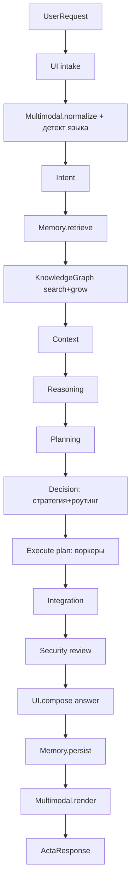

# PROJECT_AUDIT.md — ACTA

> Полный аудит репозитория. Каждое заключение подтверждено ссылками на код (`путь:строка`).
> Дата аудита: 2026-06-19. Версия: `0.1.0` (`pyproject.toml:3`).

## 1. Что это за проект

**ACTA — Autonomous Cognitive Task Assistant** (`pyproject.toml:4`): персональная когнитивная платформа
с агентным, мультимодельным, управляемым памятью ядром. Пользователь отправляет запрос (через веб-UI,
Telegram или WhatsApp), а конвейер из ~15 агентов распознаёт намерение, строит план, маршрутизирует
подзадачи на специализированных воркеров (включая **полный контроль над ОС**) и формирует ответ на
русском / иврите / английском.

- **Проблема**: единая точка входа для «мышления + действия» на машине пользователя.
- **Пользователи**: владелец машины (single-user по дизайну, `user_id="default"` — `schemas.py:66`).
- **Ценность**: локальный, офлайн-способный ассистент с памятью, графом знаний и реальными действиями в ОС.

## 2. Технологический стек

| Слой | Технологии | Где |
|---|---|---|
| Язык | Python ≥3.11 | `pyproject.toml:6` |
| Web/API | FastAPI, Uvicorn | `acta/api/app.py` |
| Модели данных | Pydantic v2, pydantic-settings | `acta/schemas.py`, `acta/config.py` |
| Шифрование | cryptography (Fernet, PBKDF2) | `acta/security/crypto.py` |
| Граф знаний | networkx (MultiDiGraph) | `acta/knowledge_graph/graph.py` |
| Хранилище | SQLite (шифрованное) | `acta/memory/store.py` |
| HTTP-клиент | httpx | провайдеры, каналы |
| Система | subprocess, psutil, signal, shutil | `acta/integration/system.py` |
| LLM-провайдеры | OpenAI, Anthropic, Gemini, Ollama, Mock | `acta/providers/` |
| Каналы | Telegram Bot API, WhatsApp Cloud API | `acta/channels/` |
| Frontend | ванильный JS/HTML/CSS | `acta/web/` |
| Опциональные | Postgres+pgvector, Neo4j, Redis (объявлены, не используются) | `pyproject.toml:27-29` |

## 3. Карта архитектуры

Точка входа `acta` → `acta.api.app:run` (`pyproject.toml:37`) поднимает Uvicorn на `127.0.0.1:8765`
(`api/app.py:185`). `create_app()` строит `AgentServices` (`agents/base.py:35`) и `Orchestrator`.

Конвейер `Orchestrator.run()` (`orchestrator/orchestrator.py:63-119`) — 15 шагов на едином объекте
`PipelineState` (`orchestrator/state.py`):

Воркеры (`agents/specialized.py:220`): `research`, `coding`, `automation`, `system`. Исполнение —
последовательное или параллельное (`ThreadPoolExecutor`, `orchestrator.py:191`) с учётом зависимостей.

Маршрутизация моделей (`providers/router.py`): профиль задачи → провайдер, с прозрачным фолбэком на
офлайн-`mock` (`router.py:102`), поэтому система не падает без ключей.

## 4. Итоговые оценки

| Критерий | Оценка (0-100) | Комментарий |
|---|---|---|
| Архитектура | 82 | Чистая, модульная, тестируемая; конвейер прозрачен |
| Качество кода | 80 | Ruff чист, типизация, единый стиль; немного дублирования |
| Безопасность | 22 | **RCE по дизайну без аутентификации** — критично |
| Масштабируемость | 35 | Поиск памяти O(N), перезапись графа на каждый запрос, один SQLite-коннект |
| Поддерживаемость | 78 | Понятные модули, документация, тесты |
| **Итог** | **58** | Сильный прототип/MVP, не готов к продакшену из-за безопасности и масштаба |

## 5. Состояние сборки

- Тесты: **42 passed** (`uv run pytest -q`), детерминированно на mock-провайдере.
- Линтер: **ruff — All checks passed**.
- Запуск: офлайн «из коробки», без ключей и внешних БД (`config.py` — все значения с дефолтами).

Подробности — в `SECURITY_REPORT.md`, `PERFORMANCE_REPORT.md`, `ARCHITECTURE_REPORT.md`,
`FEATURES_MAP.md`, `TECH_DEBT.md`, `ROADMAP.md`.
